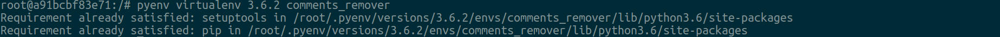
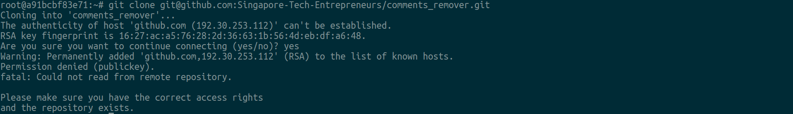
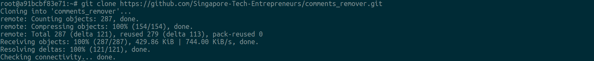
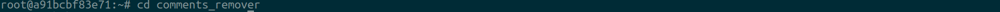
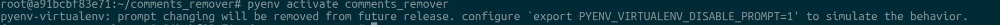
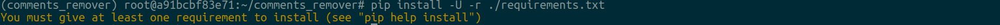
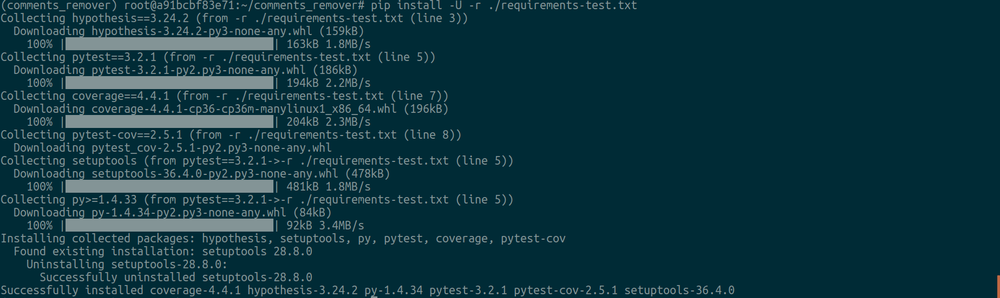
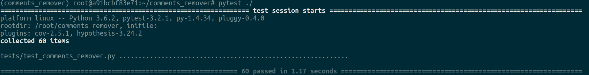
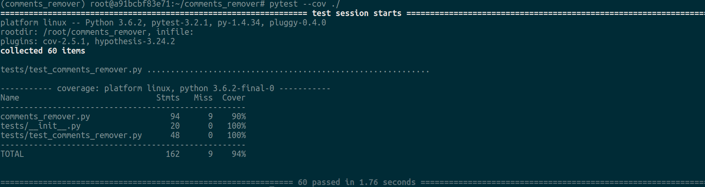

# comments_remover

Tested with the following configuration:

* Ubuntu 17;
* Python 3.6.

*Note: the below occurences of *`./`* refer to the project root unless explicitly stated otherwise*.


## Table of Contents

* [Getting Up-and-Running Locally](#getting-up-and-running-locally)
    * [Developing on Ubuntu](#developing-on-ubuntu)
    * [Usage](#usage)
* [Tips](#tips)

## Getting Up-and-Running Locally<a name="getting-up-and-running-locally"></a>


### Developing on Ubuntu<a name="developing-on-ubuntu"></a>

1. Enter the shell.
1. Install `pyenv` via [pyenv-installer](https://github.com/pyenv/pyenv-installer):
    ```shell
    $ curl -L https://raw.githubusercontent.com/pyenv/pyenv-installer/master/bin/pyenv-installer | bash
    ```
    ](./docs/images/pyenv-installer.png)
1. Follow the instructions on how to initialize `pyenv` on shell startup, for instance:
    ```shell
    $ echo 'export PATH="/root/.pyenv/bin:$PATH"' >> ~/.bash_profile
    $ echo 'eval "$(pyenv init -)"' >> ~/.bash_profile
    $ echo 'eval "$(pyenv virtualenv-init -)"' >> ~/.bash_profile
    ```
    
1. Install Python 3.6.x via `pyenv`, say Python 3.6.2 (latest micro release versions are preferred):
    ```shell
    $ pyenv install 3.6.2
    ```
    
1. Create a virtualenv for the project:
    ```shell
    $ pyenv virtualenv 3.6.2 comments_remover
    ```
    
1. Switch to whatever directory you wish the project to reside in, say `~`:
    ```shell
    $ cd ~
    ```
    
1. Clone the project from GitHub:
    * either via SSH (the preferred way):
    ```shell
    $ git clone git@github.com:Singapore-Tech-Entrepreneurs/comments_remover.git
    ```
    
    * or via HTTPS:
    ```shell
    $ git clone https://github.com/Singapore-Tech-Entrepreneurs/comments_remover.git
    ```
    
1. Switch to the project directory:
    ```shell
    $ cd comments_remover
    ```
    
1. Activate the virtualenv:
    ```shell
    $ pyenv activate comments_remover
    ```
    
1. Install project dependencies:
    ```shell
    pip install -U -r ./requirements.txt
    ```
    
1. Install dependencies for testing:
    ```shell
    pip install -U -r ./requirements-test.txt
    ```
    
1. (optional) Install [IPython](https://ipython.org/) interactive shell to speed up development:
    ```shell
    pip install ipython==6.1.0
    ```
     interactive shell to speed up development](./docs/images/pip-install-ipython-6-1-0.png)
    
To run tests, simply
```shell
pytest ./
```


To also see coverage report,
```shell
pytest --cov ./
```


You should be good to go now.


### Usage<a name="usage"></a>

Use the project's CLI to interact with the script.

Say, you want the `./tests/sources/HTML/index.html` file's comments removed. Given the project virtualenv is activated, from `./` invoke
```shell
$ python comments_remover.py ./tests/sources/HTML/input.html HTML ./
``` 

This will take `./tests/sources/HTML/input.html`, designated as `HTML` file, and put the copy of the former (with HTML-specific comments removed, obviously) to `./` named `rc.input.html`. The latter is the name of the original file prefixed with `rc.` by default. 

To see full CLI specification, run 
```shell
$ python comments_remover.py
```


## Tips<a name="tips"></a>

If you're not using [PyCharm](https://www.jetbrains.com/pycharm/) yet, make sure to at least consider this as an option. 
Also check out [JetBrains Toolbox](https://www.jetbrains.com/toolbox/), a single tool to rule them all (the JetBrains products). 
To stay up-to-date, follow [PyCharm Blog](https://blog.jetbrains.com/pycharm/). 
