# Comments Remover Jenkins plugin

This plugin removes comments from source files for a number of programming languages. Required Python 3 on Jenkins server.
A new build step is added: 'Invoke Comments Remover' which accepts files to process as input and creates uncommented
version of them. 

User can specify Python path in global settings for the plugin (otherwise the one on the system PATH is used).

### Before build
Put ZIP archive of Comments Remover (in Python) in `src/main/resources`.
The plugin expects to find `comment_remover.py`  and `requirement.txt` in the archive.

### Debug
`mvnDebug hpi:run`

You can attach Java Debugger to a local Java process of Jenkins.

### Prepare plugin for distribution
`mvn package`

The *.hpi file will be created in target/ directory.
To install manually on local Jenkins, copy it to $JENKINS_HOME/plugins directory.

# Global settings

Go to Manage Jenkins -> Configure System to access them

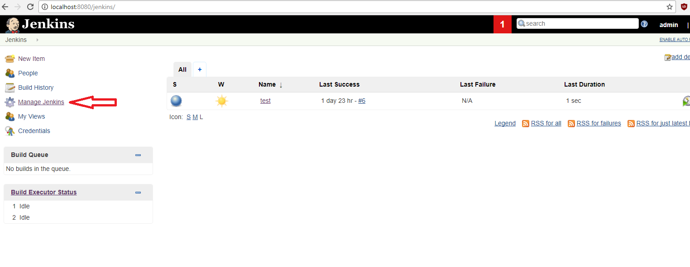

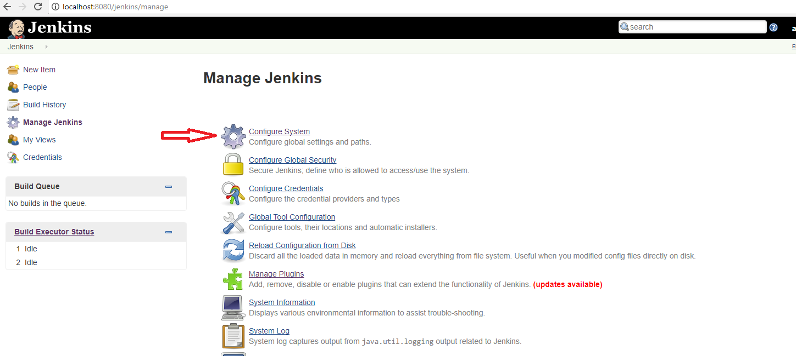

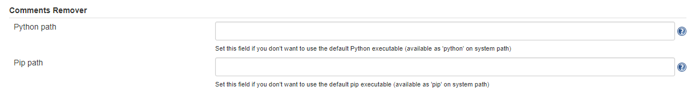

There is help section to provide examples:

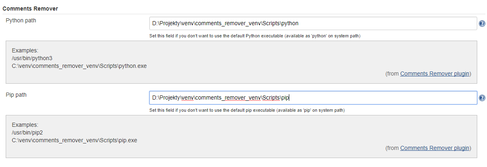

# Usage

The plugin can be used wherever build steps can be defined, e.g. Freestyle project

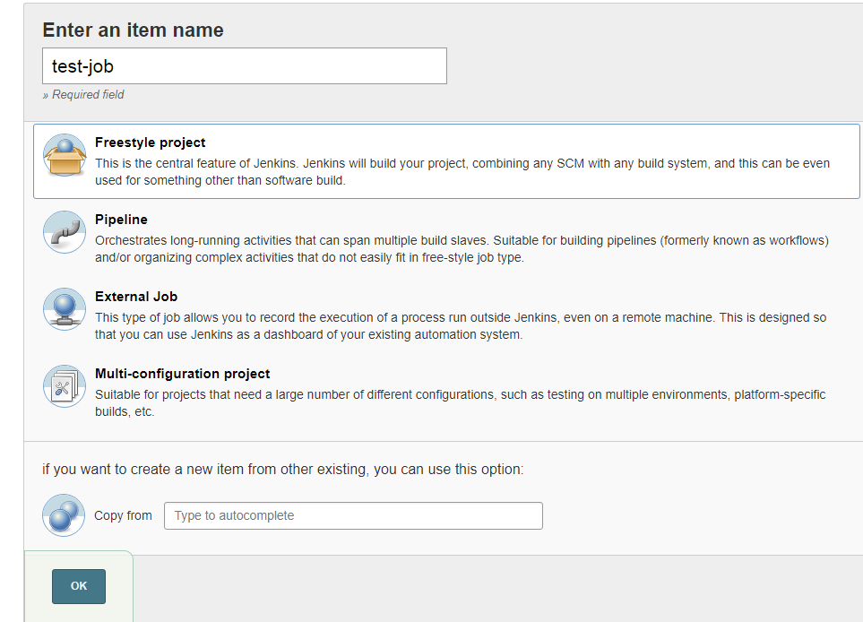

Adding build step:

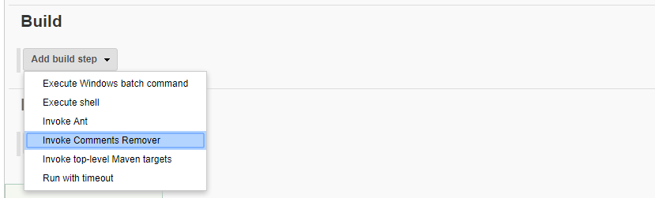

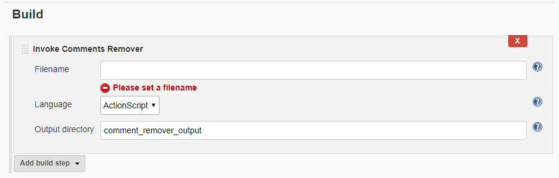

This part also has "help" section:

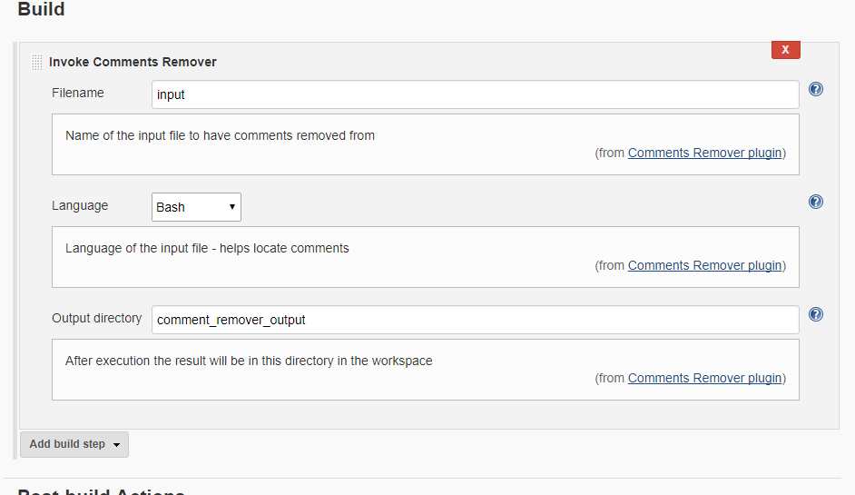

##### Example of build output and result:

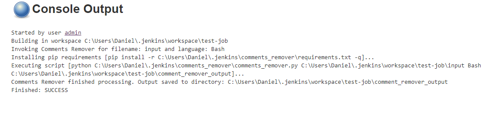

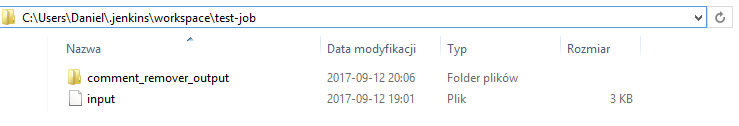

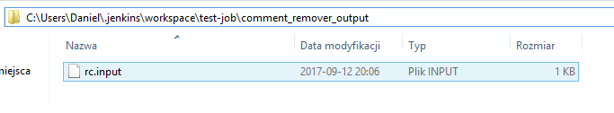